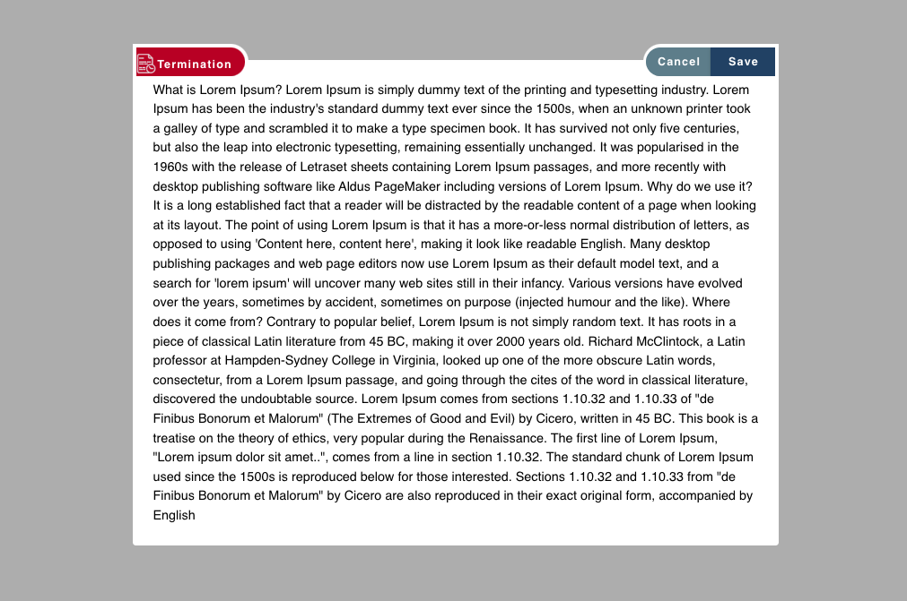

# Overflow Dialog Component

## Overview

This repository contains two Vue.js components: `Home.vue` and `OverflowDialog.vue`.

- **Home.vue**: A component that provides a sample implementation of the `OverflowDialog` component.
- **FleetOverflowDialog.vue**: A reusable dialog component with configurable content, title, and action buttons. The dialog is designed to be used for a variety of modal use cases.

## Components

### 1. FleetOverflowDialog.vue

A dialog component built using Vuetify's `v-dialog`. It supports a customizable header, configurable action buttons, and a content area that accepts slots for flexibility.

#### Props

| Prop          | Type    | Default    | Description                                             |
| ------------- | ------- | ---------- | ------------------------------------------------------- |
| `modelValue`  | Boolean | `false`    | Controls the visibility of the dialog.                  |
| `title`       | String  | `"Dialog"` | The title of the dialog displayed in the header.        |
| `icon`        | String  | `""`       | Optional icon to be displayed in the header.            |
| `width`       | String  | `"900"`    | Width of the dialog.                                    |
| `height`      | String  | `"500px"`  | Height of the dialog.                                   |
| `noPadding`   | Boolean | `false`    | Removes padding in the content area if `true`.          |
| `disabled`    | Boolean | `false`    | Disables the "Save" button if `true`.                   |
| `colorOfDialog` | String  | `"primary"` | Sets the color of the dialog header.                    |
| `SaveLabel`   | String  | `"Save"`   | The label for the "Save" button.                        |
| `cancelLabel` | String  | `"Cancel"` | The label for the "Cancel" button.                      |
| `loading`     | Boolean | `false`    | Displays a loading spinner on the "Save" button.        |
| `showsaveBtn` | Boolean | `true`     | Controls whether the "Save" button is visible.          |
| `imgIcon`     | Boolean | `false`    | Controls whether the header uses an image icon.         |

#### Slots

- **`content`**: The slot used to provide the content of the dialog.

#### Events

- **`update:modelValue`**: Emits when the dialog visibility is changed.
- **`close`**: Emits when the "Cancel" button is clicked to close the dialog.
- **`save`**: Emits when the "Save" button is clicked to perform an action.

#### Example Usage

```vue
<template>
  <div>
    <v-btn class="text-white terminate-btn" color="#E11900" @click="onClick">
      <div class="text-capitalize" style="display: flex; align-items: center">
        Click Me
      </div>
    </v-btn>
    <overflow-dialog
      :key="`fleet-overflow-dailog-salary-assistant`"
      :noPadding="true"
      :modelValue="showOverFlowDialog"
      :title="'Termination'"
      :imgIcon="true"
      :icon="terminationIcon"
      :colorOfDialog="'error'"
      @close="onCloseOverflow"
      @save="onCloseOverflow"
      :width="'800'"
      :height="'900px'"
      :SaveLabel="'Save'"
    >
      <template v-slot:content>
        <div class="container">
          Lorem Ipsum is simply dummy text of the printing and typesetting industry...
        </div>
      </template>
    </overflow-dialog>
  </div>
</template>

<script setup>
import { ref } from "vue";
import terminationIcon from "@/assets/images/hr/termination.svg";

const showOverFlowDialog = ref(false);

const onClick = () => {
  showOverFlowDialog.value = !showOverFlowDialog.value;
};

const onCloseOverflow = () => {
  showOverFlowDialog.value = !showOverFlowDialog.value;
};
</script>

<style scoped>
.container {
  margin: 25px !important;
}
</style>
